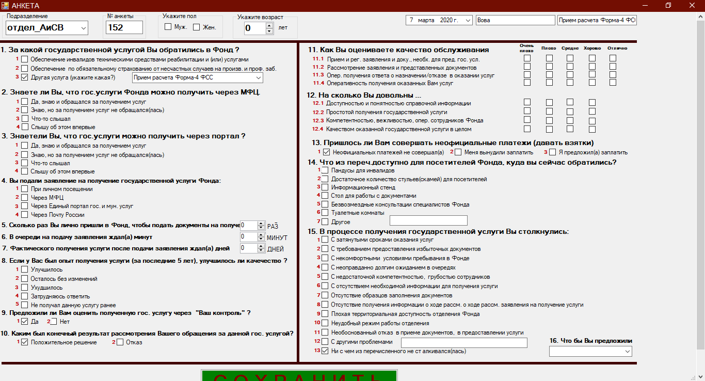
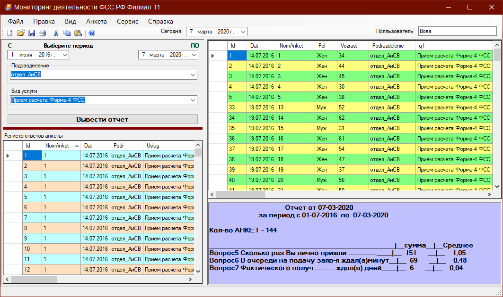
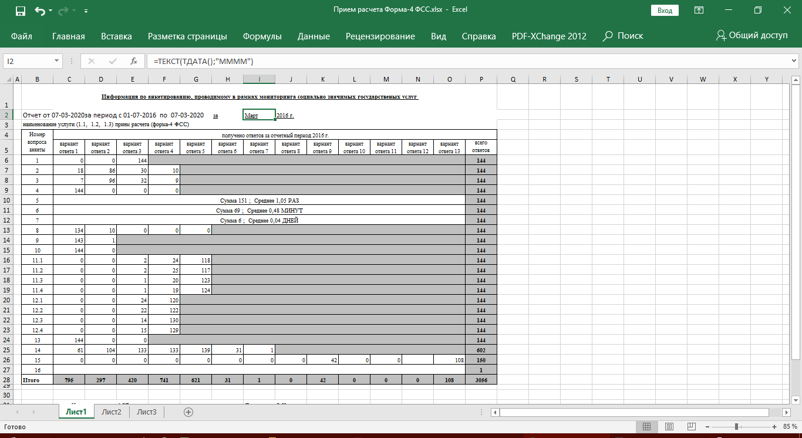

# AnketaFSS
К HyTech отношения не имеет , но к C# и ЕИИС , поэтому положу может заинтересует кого нибудь
Страхователи приходят им каждый раз предлагают заполнить анкету , потом собирают статистику и каждый месяц отчеты в Региональное отделение.
 Вот такое быстрое решение на С# + SQLite в качестве БД
 
 Это сама форма для заполнения анкеты
 

Потом специалист (по отделам) открывает 

задает период  кнопку клац и готово отчет открывается сам в Ексель

